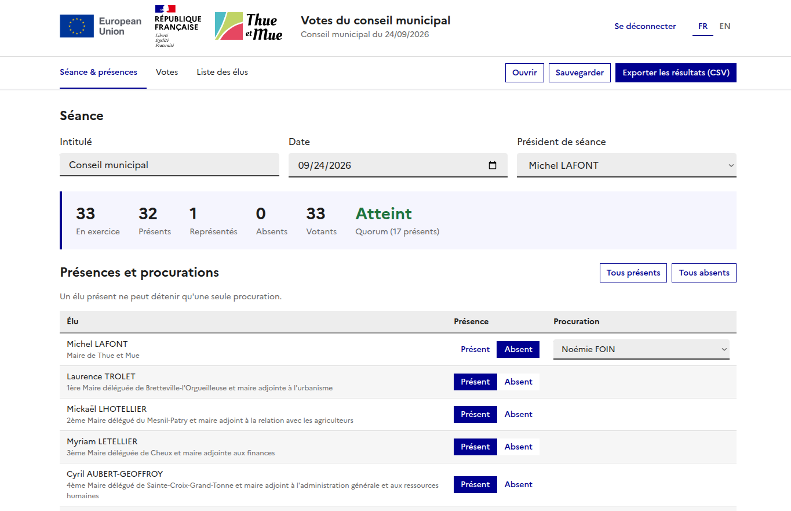

# Votes du conseil municipal – Thue et Mue

Petit site pour enregistrer les présences, les procurations et les résultats de vote d'une séance du conseil municipal, puis les exporter.



## Contenu du dossier

| Fichier                | Rôle                                   |
|------------------------|----------------------------------------|
| `index.html`           | La page du site (à ouvrir)             |
| `style.css`            | La mise en forme                       |
| `config.js`            | L'empreinte de la clé de connexion     |
| `logo_thue_et_mue.svg` | Logo de la commune                     |
| `rf_logo.svg`          | Logo de la République française        |
| `logo_eu.png`          | Logo de l'Union européenne             |
| `logo_thue_et_mue.png` | Icône de l'onglet du navigateur        |
| `image.png`            | Capture d'écran utilisée dans ce README |
| `js/i18n.js`           | Les textes en français et en anglais   |
| `js/data.js`           | La liste d'origine des élus            |
| `js/utils.js`          | Petites fonctions utilitaires          |
| `js/state.js`          | Les données de la séance, présences et procurations |
| `js/votes.js`          | Le calcul des résultats de vote        |
| `js/render.js`         | L'affichage des onglets                |
| `js/actions.js`        | Les actions (ajouter, modifier, supprimer…) |
| `js/export.js`         | L'export CSV, la sauvegarde et l'ouverture |
| `js/auth.js`           | La clé de connexion                    |
| `js/main.js`           | Le démarrage du site                   |

Gardez tous ces fichiers **dans le même dossier** (et le sous-dossier `js/` à côté de `index.html`).

## Démarrer le site
python3 -m http.server 8000
### Méthode simple (recommandée)

Double-cliquez sur **`index.html`**. Le site s'ouvre dans votre navigateur (Firefox, Chrome, Edge…).
Aucune installation n'est nécessaire. Le site fonctionne sans internet ; seule la police Marianne (charte de l'État) est téléchargée en ligne, et Arial la remplace automatiquement hors connexion.

### Méthode alternative (petit serveur local)

Si vous préférez passer par une adresse `http://`, ouvrez un terminal dans le dossier puis lancez :

```bash
python3 -m http.server 8000
```

Ouvrez ensuite <http://localhost:8000> dans le navigateur. Pour arrêter : `Ctrl + C` dans le terminal.

## Clé de connexion

Au démarrage, le site demande une clé de connexion.

- **Clé par défaut : `ThueEtMue2026`** (à changer avant la première utilisation).
- La connexion est conservée tant que l'onglet reste ouvert. Le bouton « Se déconnecter » verrouille le site.

### Changer la clé

1. Calculez l'empreinte de la nouvelle clé dans un terminal (remplacez `MaNouvelleCle`) :

   ```bash
   echo -n "MaNouvelleCle" | sha256sum
   ```

   Sous Windows (PowerShell) :

   ```powershell
   $s=[Text.Encoding]::UTF8.GetBytes("MaNouvelleCle"); -join ([Security.Cryptography.SHA256]::Create().ComputeHash($s) | % { $_.ToString("x2") })
   ```

2. Copiez la suite de 64 caractères obtenue dans `config.js`, entre les guillemets de `CLE_HASH`.
3. Rechargez la page.

> ⚠️ Cette clé empêche une personne de passer devant l'écran et d'utiliser le site, mais ce n'est pas une vraie sécurité : quelqu'un qui a accès aux fichiers ou à l'ordinateur peut contourner la clé et lire les données enregistrées dans le navigateur.

## Langue

Les boutons **FR / EN** (en haut à droite et sur l'écran de connexion) passent le site en français ou en anglais. Le choix est mémorisé. L'export CSV est produit dans la langue affichée.

Les noms et fonctions des élus restent tels qu'ils sont saisis (en français).

Pour modifier un texte ou ajouter une langue, éditez `js/i18n.js`.

## Utilisation

1. **Liste des élus** : vérifiez la liste. Vous pouvez y modifier un nom ou une fonction, ajouter ou supprimer un élu.
2. **Séance & présences** :
   - renseignez l'intitulé, la date et le président de séance ;
   - pour chaque élu, choisissez « Présent » ou « Absent » ;
   - pour un absent, choisissez dans le menu l'élu présent qui porte sa procuration (une seule procuration par élu présent) ;
   - le nombre de présents, de représentés et de votants, ainsi que le quorum, s'affichent en haut.
3. **Votes** :
   - ajoutez une délibération (numéro et objet) ;
   - tous les votants sont comptés « Pour » par défaut : cliquez sur « Saisir les votes » pour changer le vote d'un élu (Pour, Contre, Abstention, NPPV = ne prend pas part au vote) ;
   - le résultat (adopté, rejeté, unanimité) se calcule tout seul. En cas d'égalité, la voix du président de séance l'emporte.

## Exporter et sauvegarder

- **Exporter les résultats (CSV)** : télécharge un fichier à ouvrir dans Excel ou LibreOffice. Il contient les informations de la séance, le résultat de chaque délibération et le détail élu par élu.
- **Sauvegarder** : télécharge un fichier `.json` avec toute la séance.
- **Ouvrir** : recharge une séance sauvegardée.

## Important

- Les données sont enregistrées automatiquement **dans le navigateur de cet ordinateur uniquement**. Elles ne sont pas partagées avec d'autres postes et peuvent disparaître si vous videz les données du navigateur.
- **Exportez ou sauvegardez à la fin de chaque séance.**
- Le bouton « Nouvelle séance » efface les présences et les votes, mais garde la liste des élus.
